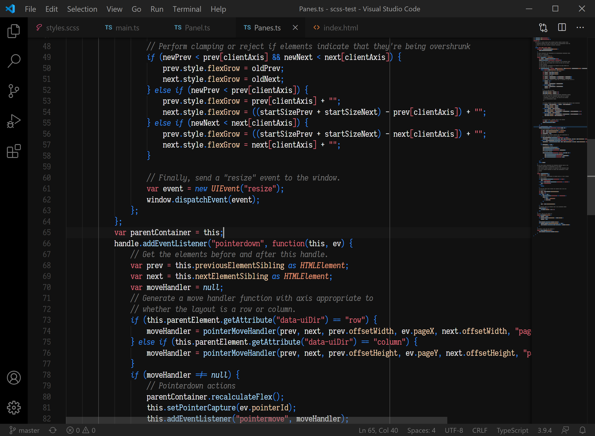
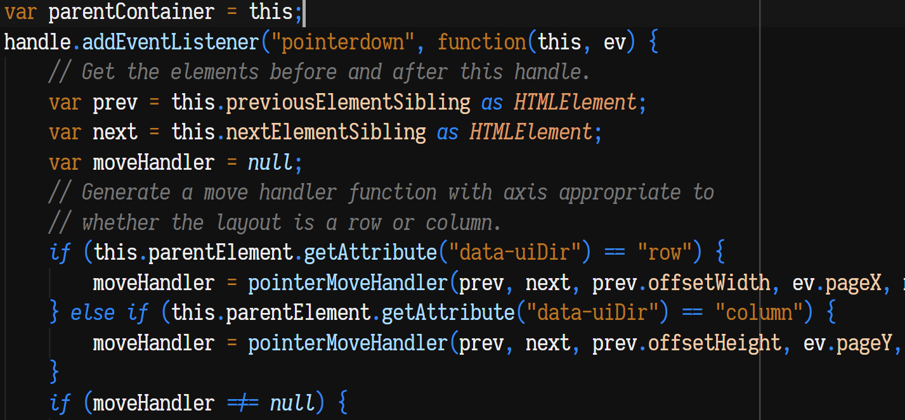
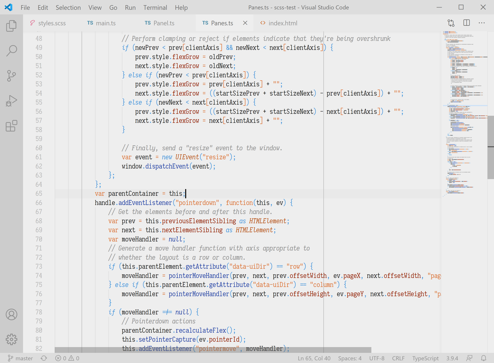

# Astronomy
Astronomy is a dichromatic color theme meant for keeping things straightforward
and functional.

Source code starts at neutral, then shifts either warmer to represent value, or
cooler to represent logic.

Equations stay neutral with minimal variance, so separators like strings and
brackets are the only things that stick out.

There are no bright, vibrant colors; you and your extensions are free to use
those for yourself.

Also included is a red-green colorblind accessible version of this theme.

A light version is also included.

## Tips
* Although *any* font is fine, the font featured in the screenshots is [Iosevka Slab](https://github.com/be5invis/Iosevka).
* This theme works well with [Bracket Pair Colorizer 2](https://github.com/CoenraadS/Bracket-Pair-Colorizer-2).

---------

## Building
Use the default gulp task to build the `xxx-color-theme.json` files which will be used by VS Code. Also available is a `watch` task which will automatically build the theme files whenever the template file or palette files are updated.

To add a new theme to be built, modify the `palettes` variable in the `build` function in the gulpfile. Create a new palette file in the `src` directory, e.g. `xyz.json`. Then, add `xyz` as an entry in the `palettes` variable mentioned above. The output theme file will be `astronomy-xyz-color-theme.json` in the `themes` directory. Don't forget to update `package.json` to include the new theme, or else it won't appear as an option in VS Code.

## Palette files
Inside the `src` directory are several small JSON files containing some color definitions, which are then plugged into `_template.json` to create the output theme, which VS Code uses.

* `name`: This populates the "name" field in the output theme file.
* `type`: This populates the "type" field in the output theme file, and whether the type is "light" or not will alter how interpolated colors are generated (see below)
* `v1`, `v2`, etc: These are the **value** tints. The higher the number, the stronger the tint.
* `l1`, `l2`, etc: These are the **logic** tints. The higher the number, the stronger the tint.
* `b`: This is the **background** color, used all over the UI.
* `n`: This is the **neutral** color, used as the text color when there's no tinting, but also the foreground color for various UI elements.

### Interpolated Colors
Several extra colors are derived from the palette file during the build process, these are **interpolated colors**.

* `v1-75`: This means color `v1` at `75%`. If the theme is dark, lower percentages darken the color. If the theme is light, lower percentages lighten the color. Currently, valid percentages are 25, 33, 50, 67, and 75.
* `negative`: This color is either black if the theme is dark, or `b-75` if the theme is light. Its intended use is for negative space and dividers in the UI.

You are free to override any interpolated colors by specifying them in the palette file directly. For example, defining `v1-25` in the palette file will override the auto-generated `v1-25`.